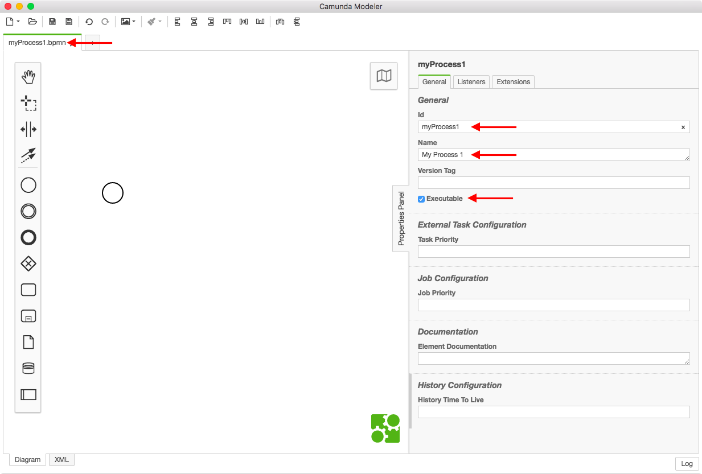
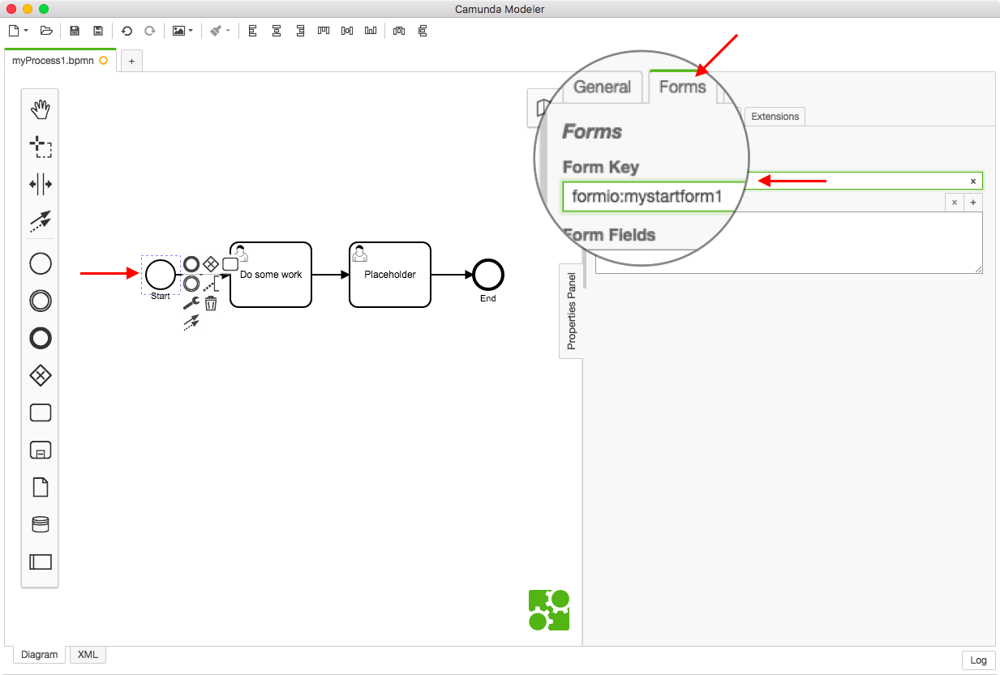
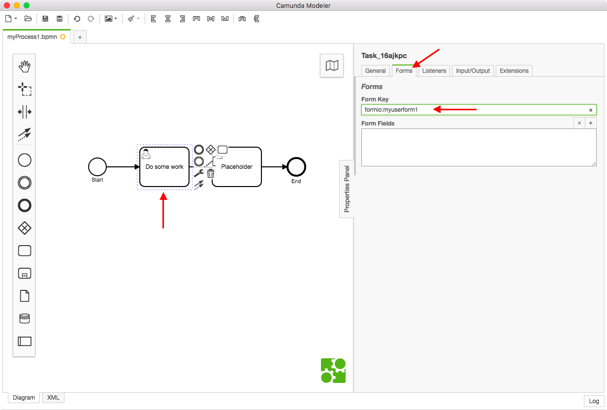
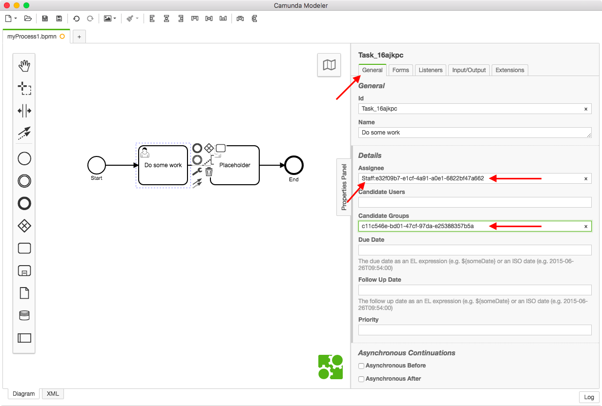
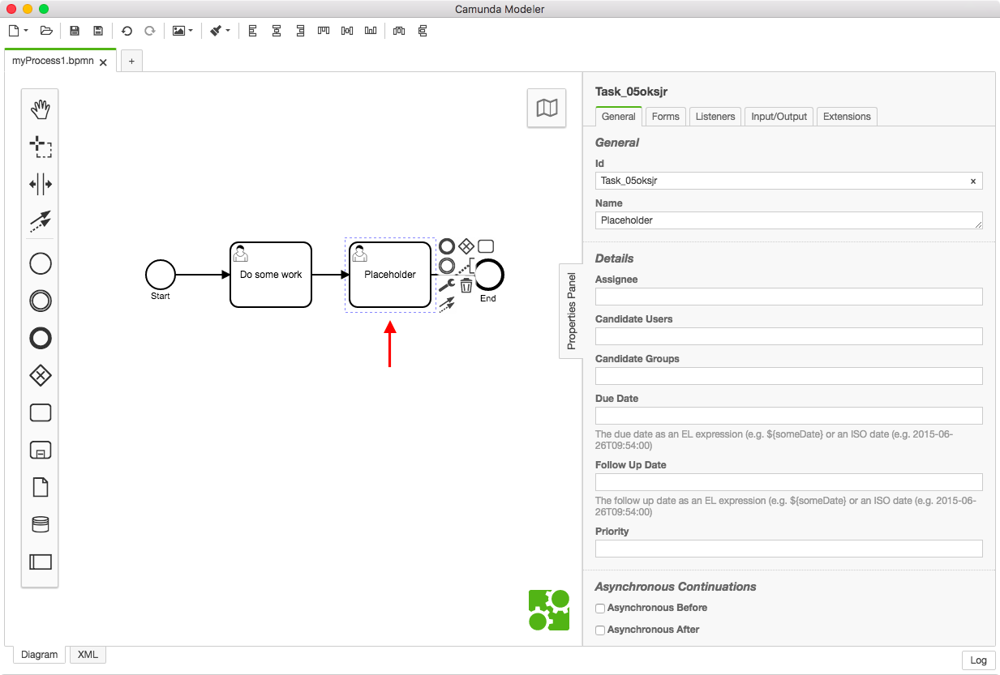

# Building Your First Digital Public Service

This guide covers two walkthroughs: Quick Start, and Detailed Walkthrough.

# Quick Start

## Deploy platform

1. Deploy the platform using the [SDK](https://github.com/DigitalState/Sdk).
1. Install [Camunda Modeler](https://camunda.org/download/modeler/)
1. Install Postman
    1. Install Desktop version of [Postman](https://www.getpostman.com)
    1. Import DigitalState Postman Collections from the DigitalState [SDK](https://github.com/DigitalState/Sdk): Look in the following folder: `resource` > `postman`
1. Open/Login to the following applications:
    1. DigitalState Admin
    1. DigitalState Portal
    1. Camunda Cockpit
    1. Formio Admin
    1. Postman (desktop)
    1. Camunda Modeler (desktop)

## Create BPMN

1. In Camunda Modeler create a BPMN for your business process that orchestrate your service.
1. Set `Process Id`
1. Set `Process Name`
1. Ensure process is marked as `Executable`
1. Save your .bpmn file with the same name as the `Process Id`. (This is just a 'quaility of life' best practice)

1. Draw a basic process to get yourself started and set your Start Event Form-Key.  The `Form-Key` uses the pattern `[formsystem]:[UniqueFormName]`. Example: `formio:mystartform1`.

1. Set the `Form-Key` for the User Task using the same pattern as the Start Event.

1. When configuring User Tasks you must configure a Candidate Group and optionally a Assignee.  The `Assignee` field must be pre-pended with the Identity Type (Individual, Organization, Staff).  The `Assignee` and `Candidate Group` fields use Identity UUIDs.  The Candidate Group uses the Identity `Business Unit` for its UUIDs and therefore no pre-pending of Identity Type is required in the `Candidate Group` field.
  
Example: 
**Assignee:** `Staff:e32f09b7-e1cf-4a91-a0e1-6822bf47a662`.
 
**Candidate Group:** `c11c546e-bd01-47cf-97da-e25388357b5a`.
  
In practice these fields would typically be dynamically generated based on scripts, DMN, and Expression Language usage. Note that permissions are inherited from the Candidate Group; a User will not be able to access the Task if they do not have the proper permissions for the Candidate Group UUID (the Business Unit Identity).

1. The placeholder user task is a Quality of Life best practice that ensures a process does not complete until the developer chooses.  It allows the developer to inspect process variables through the Camunda Cockpit (Camunda Community Edition) as only active processes are shown in the Camunda Cockpit.

1. Create your End Event

Save your .bpmn file and you are ready to create your forms.

>**NOTE:** User Task Support in the DigitalState API / the Tasks Microservice, is a Enterprise Only feature and is not included as Community Open Source.  Contract DigitalState for Enterprise Access.

## Create Form(s)

### Start Event Form (`mystartform1`)
1. In Formio Admin, open the Form Editor
1. Set form Title, Name and Path.  The Path is the name that you used in your Form-Key on the Start Event.
1. Add some fields
1. Save the Form
1. You will now be on the Form View/Input page; select the `Form Actions` tab and remove the "Save Submission` action.
1. Go to the `Permissions` tab and delete all permissions.
1. In the `Permissions` tab, add the `Anonymous` role to the "Create own Submissions" permission.

### User Task Form
Repeat the steps from Start Event Form, for the User Task Form but use the User Task's Form-Key (`myuserform1`).

### Data Resolvers (Enterprise Feature)

1. When configuring a field, you can auto-populate data from the current Identity accessing the Form (during runtime) or data from the active Camunda Process Instance.
1. To access Identity Context Data use the following:
    1. Edit a Form Field: Select the Data Tab: and edit the `Default Value` field.
    1. The following pattern is used: 
    `ds[identity].persona.data.first_name`
     
    Where `ds` is the namespace identifier.  `[identity]` is the context to which permissions and the resolver is to function in.  `identity` tells the resolver to use the current user's identity for permissions and data access. The  `.persona` accesses the current Identity's persona in the Identities microservice. The `.data` accesses the `data` column in the Identity (`data` is a JSON column). The `first_name` is a JSON property accessor for the json object inside of the `data` column.  Anything after `.data` is parsed as a JSON property and array accessor using standard json accessor patterns.
1. To access the BPM Content Data use the following:
    1. Edit a Form Field: Select the Data Tab: and edit the `Default Value` field.
    1. The following pattern is used: 
    `ds[bpm].task.variable.start_data.someKey`
     
    The pattern is the same as the Identity pattern by with some minor differences: Where `bpm` is the context that tells the form to detect what User Task the form is being called from and what Process Instance the User Task is apart of.  Where `.task.variable` accesses the variables in the Task sub-system in Camunda. The `start_data` is the Process Variable that stores the Start Event's submission / json variables.  The `someKey` is the JSON property inside of the `start_data` variable.  Use JSON accessors the same way they are used in the Identity context to access JSON properties.  Note that `start_data` can be changed for any JSON variable that is created during the Process Instance life-cycle.

## Create Service Scenario in Service Directory

1. Open the DigitalState Admin web app
1. Navigate the menu to Services > Service Directory. and Create a new Service.
1. Configure the mandatory Service fields
1. Once the service is created, create a Service Scenario inside of the previously created Service.  Use the `BPM` scenario type.
1. Set the `Process Definition Key` to the `Process Id` value that was set in your BPMN file.
1. Configure the rest of the mandatory Service Scenario fields.

## Deploy the BPMN File

1. Open Postman
1. In the DigitalState collection navigate to: Camunda > Deployment > `POST /deployment`
1. Configure the deployment configs in the request body (Other than the deployment name, and the BPMN file, the rest can typically remain the same as the defaults in the Postman collection)
1. Add the BPMN file to the request
1. Send the Request/Deploy the BPMN file.

## Ready to Go!

1. In the DigitalState Portal web app, to go Services > Directory and select the service you created in the DigitalState Admin web app.  In the Scenario you created, select the activation button and the form should popup.
1. Fill out the form and press submit.
1. Go to the Camunda Cockpit application and navigate to Processes > My Process 1 (or whatever name you gave your BPMN process in the `Process Name` field), and you will see the active process.  Selecting into the UUID of the process will show you the specific process instance and the variables related to that process.